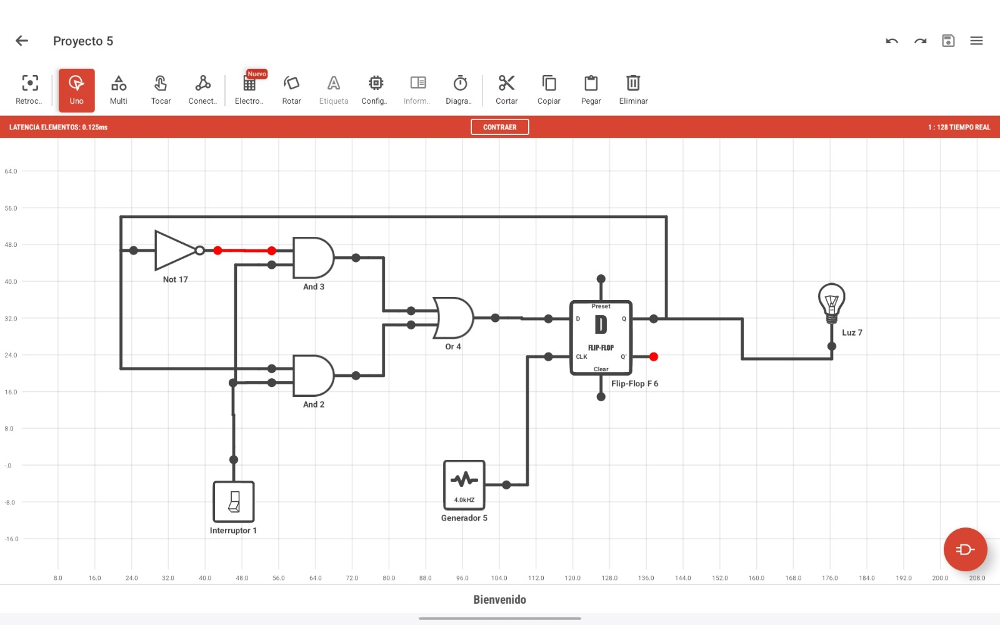

# Laboratorio-4---Digital-l

Circuito máquina de estados proyecto

Con este circuito podemos prender un led cuando el sensor de ultrasonido detecta movimient. Se usará para detectar el movimiento de los granos de café al caer por la tolva y que este pueda activar el motor que hará mover el cilindro despulpador. En este caso se usó un led, pero la idea es reemplazar dicha carga por un motor DC.
